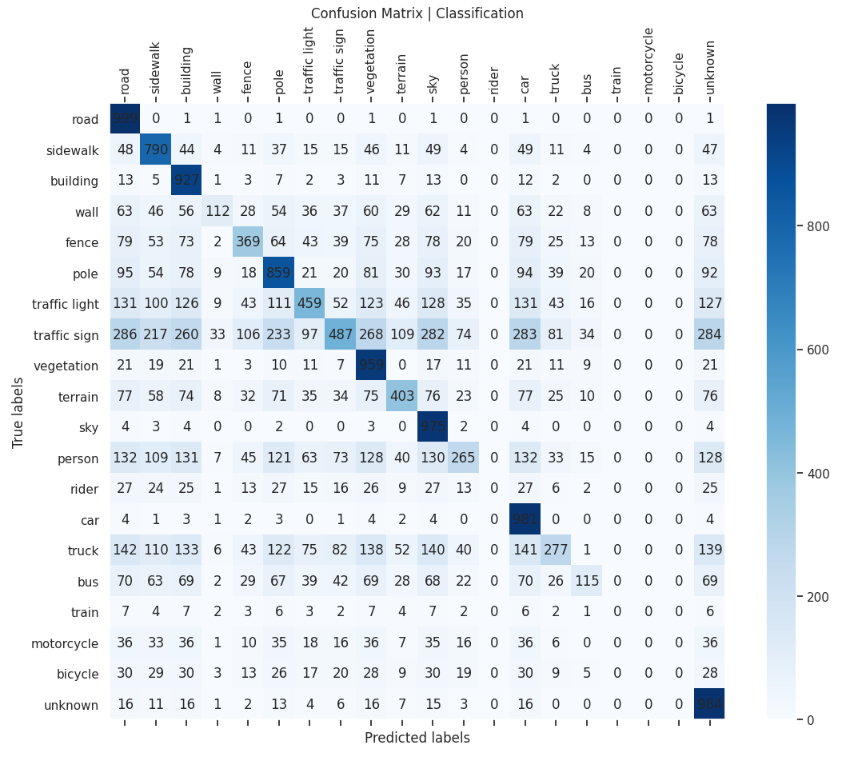

# Semantic Segmentation on BDD100K Dataset

## Overview
This project applies semantic segmentation techniques to the [BDD100K dataset](https://doc.bdd100k.com/index.html). 

We utilize the BDD100K dataset, known for its diverse driving conditions, including 10K images with rich annotations for tasks like semantic segmentation. The annotations are adjusted so that the pixel value 255, originally representing unknown objects, is mapped to 19 to fit our model's classification schema.


## Dataset

Below is the mapping from class IDs to their respective classes:

- `0`: Road
- `1`: Sidewalk
- `2`: Building
- `3`: Wall
- `4`: Fence
- `5`: Pole
- `6`: Traffic Light
- `7`: Traffic Sign
- `8`: Vegetation
- `9`: Terrain
- `10`: Sky
- `11`: Person
- `12`: Rider
- `13`: Car
- `14`: Truck
- `15`: Bus
- `16`: Train
- `17`: Motorcycle
- `18`: Bicycle
- `19`: Unknown
  
To download the datasets for the project please click on the following links:
- [Train dataset](https://dl.cv.ethz.ch/bdd100k/data/10k_images_train.zip).
- [Valid dataset](https://dl.cv.ethz.ch/bdd100k/data/10k_images_val.zip).
- [Test dataset](https://dl.cv.ethz.ch/bdd100k/data/10k_images_test.zip).
- [Labels (for Train & Valid))](https://dl.cv.ethz.ch/bdd100k/data/bdd100k_sem_seg_labels_trainval.zip).

To successfully run the notebook, make sure you set your project's root path to:


## Model
The project employs a U-Net architecture with a ResNet34 backbone, designed for precise pixel-wise classification across the dataset's 20 classes.

## Notebook
The project is encapsulated in a Jupyter Notebook, providing an end-to-end walkthrough from data preprocessing, model training, to evaluation and visualization of the results.

### How to Use
1. Clone the repository to your local machine or a compatible Jupyter environment.
2. Ensure you have Jupyter Notebook or JupyterLab installed.
3. Navigate to the cloned repository and launch the notebook:
   
```bash
jupyter notebook semantic_segmentation_bdd100k.ipynb
```
4. Follow the steps in the notebook to train the model and evaluate its performance.

## Installation
To install the required libraries, run:

```bash
pip install -r requirements.txt
```
This will install all necessary dependencies to run the notebook, including PyTorch, FastAI, and PIL.

## Results
The notebook includes detailed sections on model evaluation, showcasing accuracy, Intersection over Union (IoU), and F1-score among other metrics. Visualizations are provided to compare the model's predictions against the ground truth.

### Results with cross-entropy loss

You can see that although the general results are not bad, there are degenerate classics. These classes are represented by a missing representation in the data as you can see:

#### Segmentation 

#### Classification



## Contributing
Contributions are welcome. If you have suggestions for improving the project, please open an issue or submit a pull request.

## License
Using the BDD100K dataset requires compliance with its license terms. Ensure to adhere to these when utilizing the dataset.

## Contact
For questions or support, feel free to open an issue in the repository. Your feedback and inquiries are highly appreciated.

