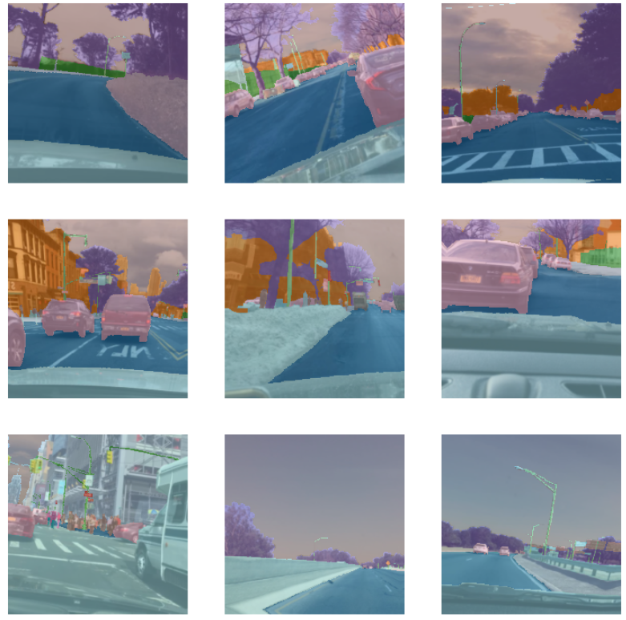

# Semantic Segmentation on BDD100K Dataset

## Overview
This project applies semantic segmentation techniques to the [BDD100K dataset](https://doc.bdd100k.com/index.html). 

The goal is to classify pixel-wise annotations to understand the driving environment better.



## Dataset
The dataset used is the BDD100K, which provides 10K images with rich annotations for various tasks including semantic segmentation. Annotations have been adjusted so that the pixel value `255` corresponds to the `unknown` class and is represented by `19` in our adjusted masks.

Below is the mapping from class IDs to their respective classes:

- `0`: Road
- `1`: Sidewalk
- `2`: Building
- `3`: Wall
- `4`: Fence
- `5`: Pole
- `6`: Traffic Light
- `7`: Traffic Sign
- `8`: Vegetation
- `9`: Terrain
- `10`: Sky
- `11`: Person
- `12`: Rider
- `13`: Car
- `14`: Truck
- `15`: Bus
- `16`: Train
- `17`: Motorcycle
- `18`: Bicycle
- `19`: Unknown
  
## Model
We use a U-Net architecture with a ResNet34 backbone for the task of semantic segmentation. The model is trained to predict 20 classes based on the BDD100K dataset specification.

## Installation
Instructions for setting up the project environment:

```bash
git clone [sem-seg-bdd100k](https://github.com/ronigold/sem-seg-bdd100k.git)
cd sem-seg-bdd100k
pip install -r requirements.txt
```

## Usage
To train the model, execute the following command:

```bash
python train.py --data_path /path/to/dataset
```

To evaluate the model and generate segmentation masks:

```bash
python evaluate.py --data_path /path/to/dataset --model_path /path/to/model
```

## Custom Scripts
- `get_adjusted_mask_file_path`: A custom function included in the data preprocessing step that adjusts mask annotations for training.

## Results
After training, the results are evaluated on a hold-out test set. Metrics such as accuracy, IoU, and F1-score are reported.

## Contributing
Contributions to the project are welcome. Please fork the repository and submit a pull request.

## License
By using the BDD100K dataset, you agree to comply with the BDD100K license terms.

## Contact
For questions and support, please open an issue in the repository.


