# Semantic Segmentation on BDD100K Dataset

## Overview
This project applies semantic segmentation techniques to the [BDD100K dataset](https://doc.bdd100k.com/index.html). 

We utilize the BDD100K dataset, known for its diverse driving conditions, including 10K images with rich annotations for tasks like semantic segmentation. The annotations are adjusted so that the pixel value 255, originally representing unknown objects, is mapped to 19 to fit our model's classification schema.


## Dataset

Below is the mapping from class IDs to their respective classes:

- `0`: Road
- `1`: Sidewalk
- `2`: Building
- `3`: Wall
- `4`: Fence
- `5`: Pole
- `6`: Traffic Light
- `7`: Traffic Sign
- `8`: Vegetation
- `9`: Terrain
- `10`: Sky
- `11`: Person
- `12`: Rider
- `13`: Car
- `14`: Truck
- `15`: Bus
- `16`: Train
- `17`: Motorcycle
- `18`: Bicycle
- `19`: Unknown
  
To download the datasets for the project please click on the following links:
- [Train dataset](https://dl.cv.ethz.ch/bdd100k/data/10k_images_train.zip).
- [Valid dataset](https://dl.cv.ethz.ch/bdd100k/data/10k_images_val.zip).
- [Test dataset](https://dl.cv.ethz.ch/bdd100k/data/10k_images_test.zip).
- [Labels (for Train & Valid))](https://dl.cv.ethz.ch/bdd100k/data/bdd100k_sem_seg_labels_trainval.zip).

To successfully run the notebook, make sure you set your project's root path to:

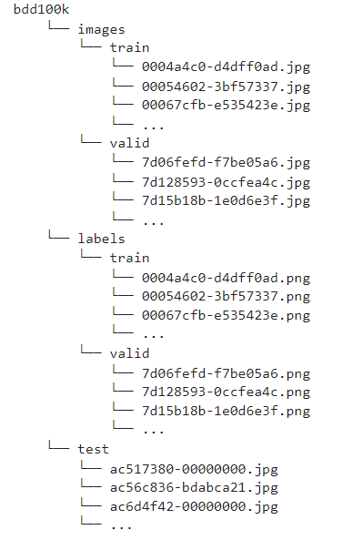

## Model
The project employs a U-Net architecture with a ResNet34 backbone, designed for precise pixel-wise classification across the dataset's 20 classes.

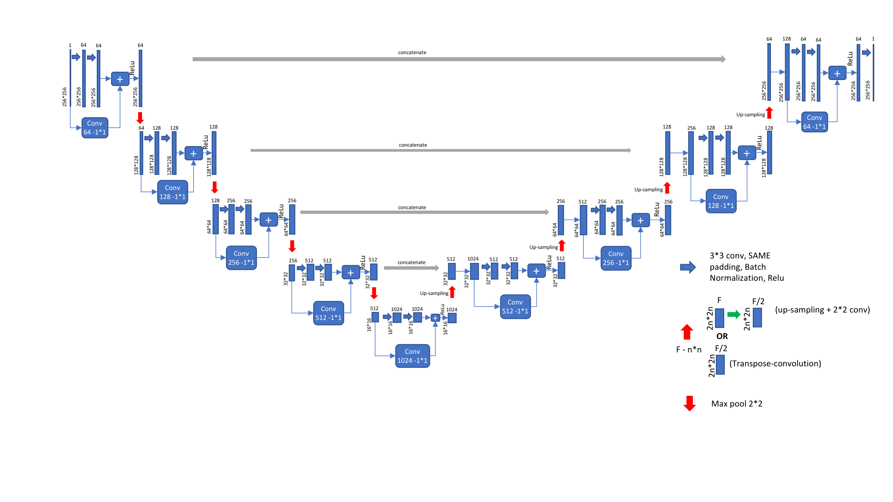

The weights are pre-trained weights on ImageNet to optimize learning and exploit the potential of transfer learning

## Notebook
The project is encapsulated in a Jupyter Notebook, providing an end-to-end walkthrough from data preprocessing, model training, to evaluation and visualization of the results.

### How to Use
1. Clone the repository to your local machine or a compatible Jupyter environment.
2. Ensure you have Jupyter Notebook or JupyterLab installed.
3. Navigate to the cloned repository and launch the notebook:
   
```bash
jupyter notebook semantic_segmentation_bdd100k.ipynb
```
4. Follow the steps in the notebook to train the model and evaluate its performance.

## Installation
To install the required libraries, run:

```bash
pip install -r requirements.txt
```
This will install all necessary dependencies to run the notebook, including PyTorch, FastAI, and PIL.

## Results
The notebook includes detailed sections on model evaluation, showcasing accuracy, Intersection over Union (IoU), and F1-score among other metrics. Visualizations are provided to compare the model's predictions against the ground truth.

The visual results shown below are based on the first model with the higher overall performance (cross_entropy)

### Sample from the Validation set (actual VS predicted)
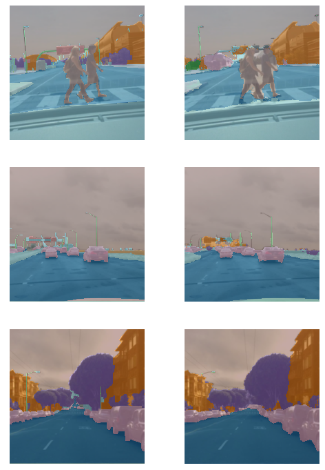

### Sample from the Test set
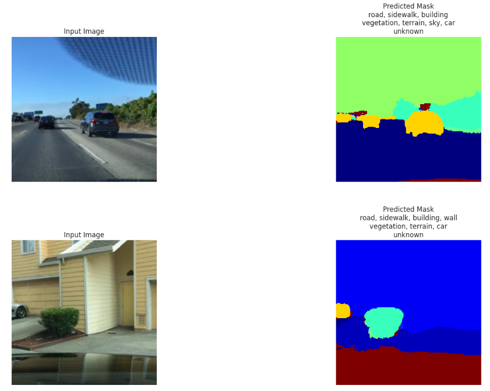

### Cross Entropy Loss

The analysis of the results shows that although the general results are not bad, there are degenerate classes. These classes are represented by missing representation in the data as can be seen:

#### Cross Entropy loss
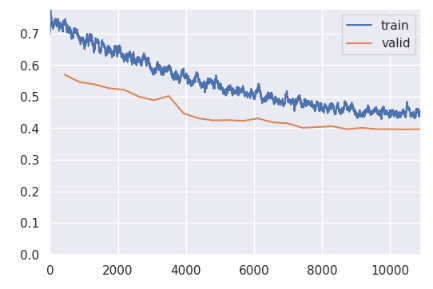

#### Segmentation 
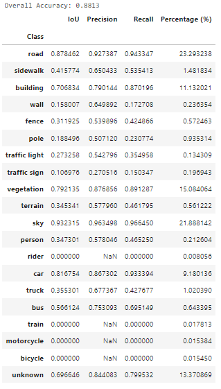
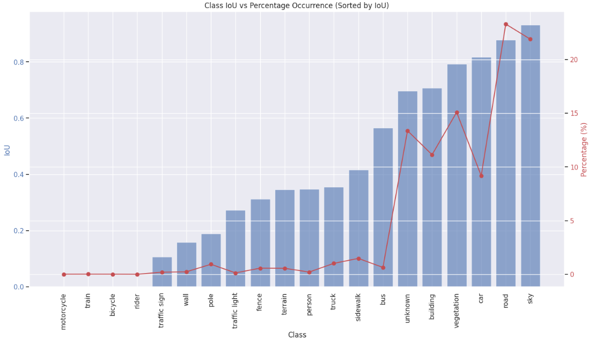


#### Classification
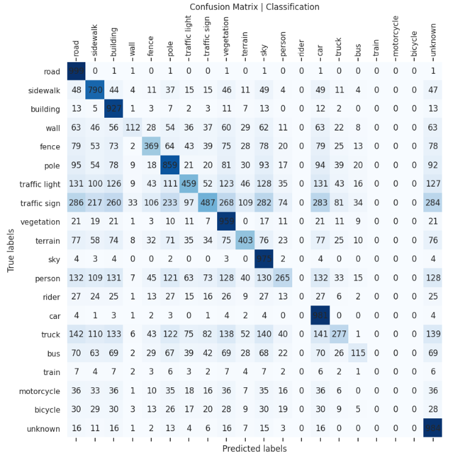
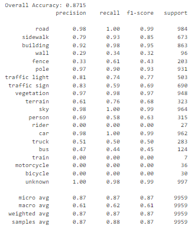

### Focal Loss + Class Weights

The "Focal Loss + Class Weights" experiment is designed to address the challenges of training a deep learning model on an unbalanced dataset, where some classes are significantly underrepresented compared to others. Focal loss is an advanced loss function that modifies the standard cross-entropy loss to put more focus on hard, misclassified examples and less on easy examples. This is achieved by adding a modulating factor to the cross-entropy loss, which reduces the loss contribution from easy examples and increases the importance of correcting misclassified ones.

Incorporating class weights into the focal loss further enhances the model's ability to deal with class imbalance. Class weights are used to assign more significance to rare classes and less to common ones during the training process. By combining focal loss with class weights, the model is encouraged not only to focus on hard examples but also to pay more attention to underrepresented classes, thereby improving overall model performance on imbalanced datasets.

#### Focal Loss + Class Weights loss
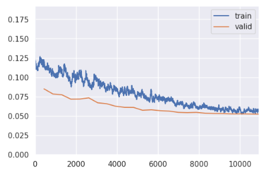
The analysis of the results shows that although the general results are not bad, there are degenerate classes. These classes are represented by missing representation in the data as can be seen:

#### Segmentation 
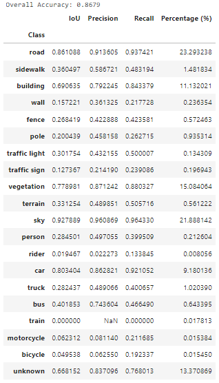
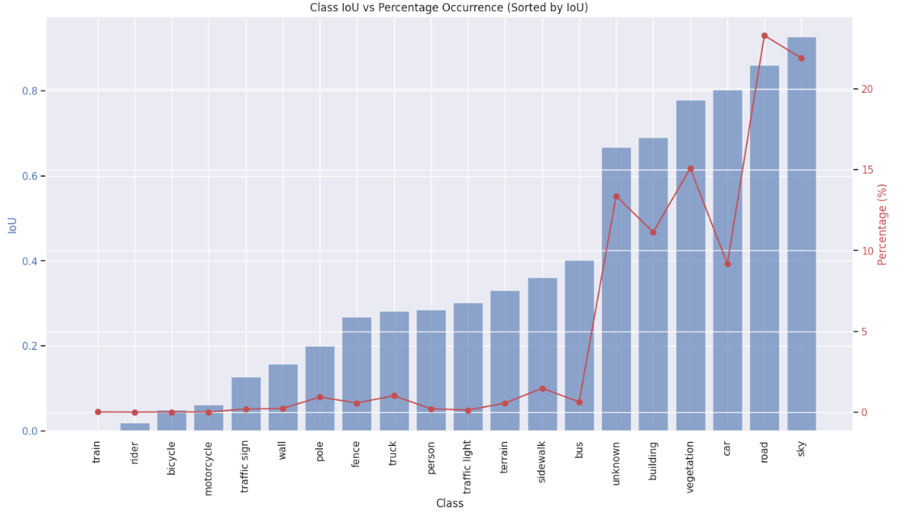

#### Classification
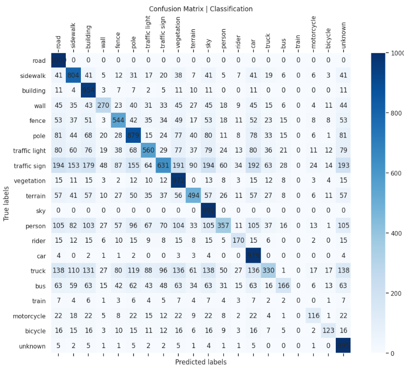
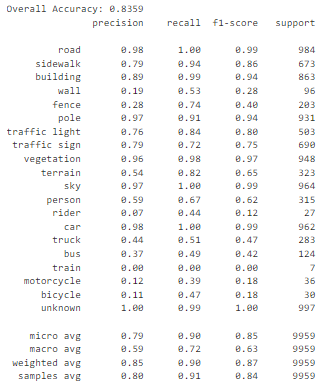

#### Visualization (on Test Set)
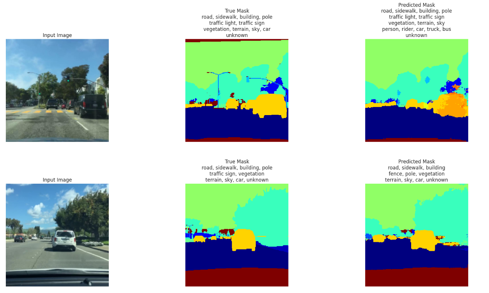

#### Conclusion
In summary, addressing data imbalance through adjustments in the loss function allowed the model to predict a broader range of classes. However, this approach led to a decrease in overall performance and introduced some noise. This issue likely stems from insufficient data for the underrepresented classes, making it difficult for the model to discern clear patterns. Consequently, this not only impacts the model's ability to learn from these classes but also affects its performance across all other classes.

## Contributing
Contributions are welcome. If you have suggestions for improving the project, please open an issue or submit a pull request.

## License
Using the BDD100K dataset requires compliance with its license terms. Ensure to adhere to these when utilizing the dataset.

## Contact
For questions or support, feel free to open an issue in the repository. Your feedback and inquiries are highly appreciated.

